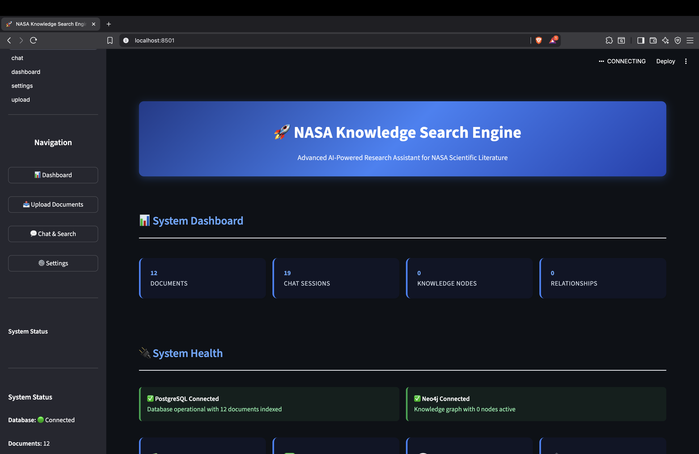

# 🚀 Astro-Scribe: AI-Powered NASA Knowledge Discovery Platform

<div align="center">



*Transform NASA research documents into an intelligent, searchable knowledge base with AI-powered insights*

[](https://nextjs.org/)
[](https://www.typescriptlang.org/)
[](https://www.docker.com/)
[](https://neo4j.com/)
[](https://www.postgresql.org/)

</div>

## 🌟 Overview

Astro-Scribe is a cutting-edge knowledge discovery platform that transforms NASA's vast collection of research documents into an intelligent, searchable database. Using advanced AI technologies including vector embeddings, knowledge graphs, and multi-agent systems, it provides researchers with unprecedented access to space science information.

## ✨ Key Features

### 🧠 **Advanced AI Processing**
- **Multi-Modal Document Analysis**: Intelligent PDF processing with OCR fallback
- **Vector Embeddings**: Semantic search using state-of-the-art embedding models
- **Knowledge Graphs**: Automated entity extraction and relationship mapping
- **Multi-Agent AI**: Specialized agents for research synthesis and fact-checking

### 🔍 **Intelligent Search & Discovery**
- **Semantic Search**: Find documents by meaning, not just keywords
- **Knowledge Graph Navigation**: Explore connections between concepts and authors
- **Citation Networks**: Trace research lineages and dependencies
- **Interactive Chat**: AI-powered conversations with source citations

### 📊 **Rich Analytics & Insights**
- **Research Trends**: Identify emerging topics and patterns
- **Author Networks**: Discover collaboration patterns
- **Publication Analytics**: Track research output over time
- **Impact Metrics**: Measure document influence and citations

### 🏗️ **Modern Architecture**
- **Microservices Design**: Scalable, maintainable architecture
- **Docker Containerized**: Easy deployment and development
- **Real-time Processing**: Instant indexing and search capabilities
- **RESTful APIs**: Extensible integration points

## 🛠️ Technology Stack

<div align="center">

| **Frontend** | **Backend** | **Database** | **AI/ML** |
|:---:|:---:|:---:|:---:|
|  |  |  |  |
|  |  |  |  |
|  |  |  |  |

</div>

## 🚀 Quick Start

### Prerequisites

- **Docker & Docker Compose** (recommended)
- **Node.js 18+** (for local development)
- **API Keys**: Groq, Google Gemini

### 1. Clone the Repository

```bash
git clone https://github.com/MRMORNINGSTAR2233/Astro-Scribe.git
cd Astro-Scribe
```

### 2. Environment Setup

```bash
# Copy environment template
cp bio-nexus/.env.docker.example bio-nexus/.env.docker

# Edit with your API keys
nano bio-nexus/.env.docker
```

Required API keys:
```env
GROQ_API_KEY=your_groq_api_key_here
GEMINI_API_KEY=your_gemini_api_key_here
```

### 3. Launch with Docker

```bash
cd bio-nexus
docker-compose up -d
```

### 4. Access the Platform

- **🌐 Main Application**: [http://localhost:3000](http://localhost:3000)
- **📊 Neo4j Browser**: [http://localhost:7474](http://localhost:7474)
- **🔧 Database**: PostgreSQL on port 5432

## 📁 Project Structure

```
Astro-Scribe/
├── 📱 bio-nexus/                 # Main Next.js application
│   ├── app/                      # Next.js app router
│   │   ├── api/                  # API routes
│   │   ├── dashboard/            # Analytics dashboard
│   │   └── upload/               # Document upload interface
│   ├── components/               # Reusable UI components
│   ├── lib/                      # Core libraries
│   │   ├── ai-services.ts        # AI integration
│   │   ├── knowledge-graph.ts    # Neo4j operations
│   │   └── pdf-processor.ts      # Document processing
│   ├── database/                 # Database schemas
│   └── docker-compose.yml        # Container orchestration
├── 📄 nasa-pdf/                 # NASA research documents (571 PDFs)
└── 🔧 scripts/                  # Utility scripts
```

## 🎯 Usage Examples

### Document Upload & Processing

```bash
# Single document upload
curl -X POST http://localhost:3000/api/upload \
  -F "file=@nasa-document.pdf"

# Bulk upload NASA documents
node scripts/bulk-upload.js
```

### Knowledge Graph Queries

```cypher
// Find papers by research area
MATCH (p:Paper)-[:MENTIONS]->(c:Concept)
WHERE c.name CONTAINS "space biology"
RETURN p.title, p.authors

// Discover author collaborations
MATCH (a1:Author)-[:AUTHORED]->(p:Paper)<-[:AUTHORED]-(a2:Author)
WHERE a1 <> a2
RETURN a1.name, a2.name, COUNT(p) as collaborations
```

### Semantic Search API

```javascript
// Search for relevant documents
const response = await fetch('/api/search', {
  method: 'POST',
  headers: { 'Content-Type': 'application/json' },
  body: JSON.stringify({
    query: "effects of microgravity on plant growth",
    limit: 10
  })
});
```

## 📊 Dashboard Features

### 📈 **Analytics Overview**
- Total documents processed
- Knowledge graph statistics
- Recent upload activity
- Search query analytics

### 🕸️ **Knowledge Graph Visualization**
- Interactive entity relationship maps
- Concept clustering and communities
- Author collaboration networks
- Research trend visualization

### 🔍 **Search Interface**
- Natural language queries
- Filter by date, author, topic
- Advanced boolean search
- Export results to various formats

## 🤝 Contributing

We welcome contributions! Here's how to get started:

1. **Fork the repository**
2. **Create a feature branch**: `git checkout -b feature/amazing-feature`
3. **Commit changes**: `git commit -m 'Add amazing feature'`
4. **Push to branch**: `git push origin feature/amazing-feature`
5. **Open a Pull Request**

### Development Setup

```bash
# Install dependencies
cd bio-nexus
npm install

# Start development server
npm run dev

# Run tests
npm test

# Type checking
npm run type-check
```

## 🐛 Troubleshooting

### Common Issues

**Database Connection Issues**
```bash
# Check container status
docker-compose ps

# Restart services
docker-compose restart
```

**PDF Processing Errors**
```bash
# Check application logs
docker logs bio-nexus-app

# Verify file permissions
ls -la uploads/
```

**Memory Issues with Large PDFs**
- Increase Docker memory allocation
- Process documents in smaller batches
- Consider document splitting for very large files

## 📜 License

This project is licensed under the MIT License - see the [LICENSE](LICENSE) file for details.

## 🙏 Acknowledgments

- **NASA** for providing open access to research documents
- **CrewAI** for multi-agent framework inspiration
- **OpenAI** and **Google** for AI model APIs
- **Neo4j** for knowledge graph technology
- **Vercel** for Next.js framework

## 📞 Support

- 📧 **Issues**: [GitHub Issues](https://github.com/MRMORNINGSTAR2233/Astro-Scribe/issues)
- 💬 **Discussions**: [GitHub Discussions](https://github.com/MRMORNINGSTAR2233/Astro-Scribe/discussions)
- 📖 **Documentation**: [Project Wiki](https://github.com/MRMORNINGSTAR2233/Astro-Scribe/wiki)

---

<div align="center">

**Made with ❤️ for the space science community**

*Transforming how researchers discover and connect NASA knowledge*

⭐ **If you find this project useful, please consider giving it a star!** ⭐

</div>